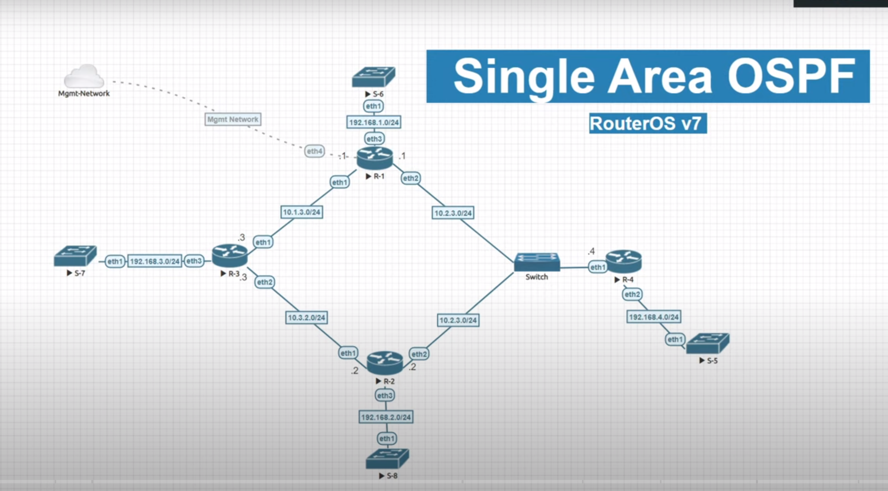
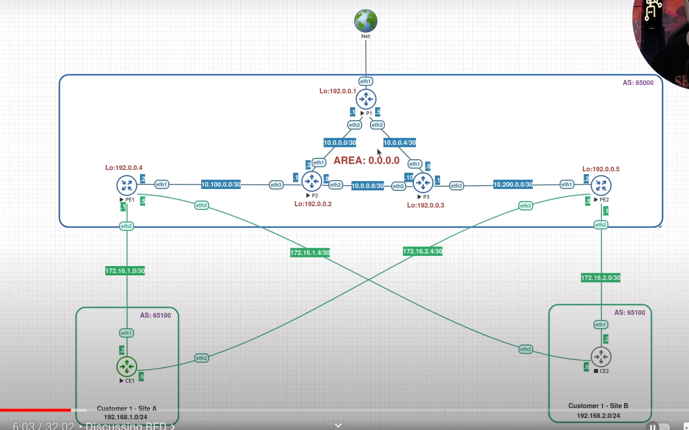

* :warning::warning: **https://www.eve-ng.net/index.php/community/**
  * https://blog.cavelab.dev/2021/06/getting-started-with-eve-ng/
  * https://www.youtube.com/watch?v=uEH3IN1295k
  * https://www.youtube.com/watch?v=kmJVScuCzIM
* :warning: **https://github.com/mingrammer/diagrams**
* **https://github.com/jamesscottbrown/pyyed**
* **https://github.com/cidrblock/drawthe.net**
* https://kroki.io/examples.html
* https://drawexpress.com/
* https://news.ycombinator.com/item?id=16889181
* **http://networkdiagram101.com/?page_id=66**
* https://www.auvik.com/franklymsp/blog/effective-network-diagrams/
    * https://www.auvik.com/lp/network-topology-free-ebook/
* https://habr.com/ru/post/273679/
* https://packetpushers.net/network-documentation-best-practices-whats-important-how-to-track-it/
* https://packetpushers.net/how-to-draw-clear-l3-logical-network-diagrams/
* https://packetpushers.net/scalable-network-diagram-layouts-tips-ms-visio/
* **https://etherealmind.com/network-diagrams-vlan-with-ip-layer-3-detail/**
* https://mum.mikrotik.com/presentations/BU19/presentation_7012_1559918854.pdf

### Examples

* https://www.youtube.com/watch?v=NuJio20QZ9Y

* https://www.youtube.com/watch?v=RBVmqaYxNB4
